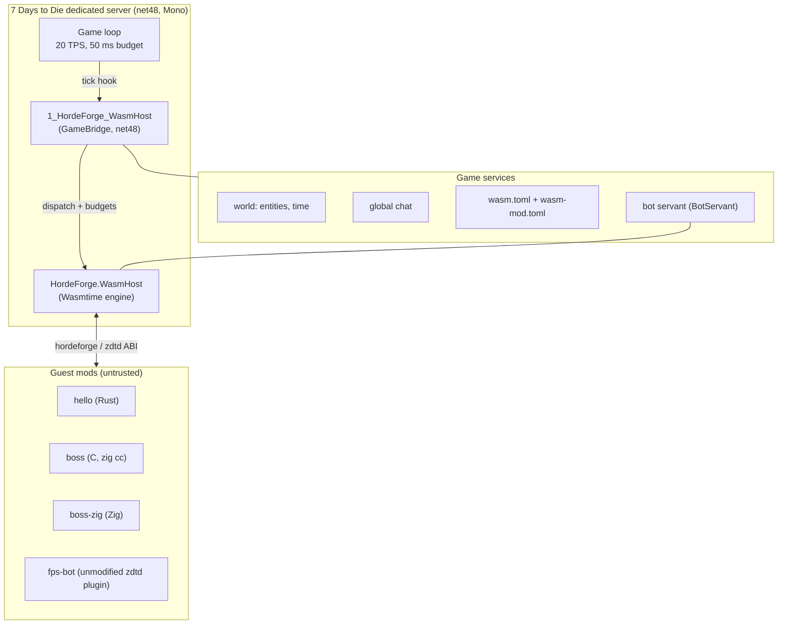
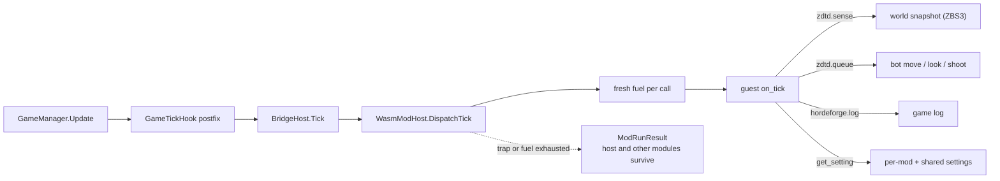
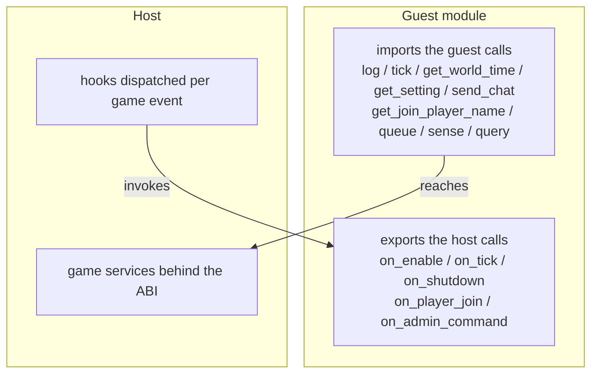
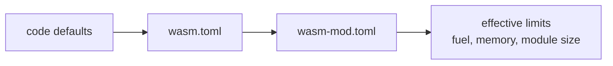

# 🧫 Quarantine (7DTD WasmHost)

> **Part of [HordeForge](https://github.com/hordeforge)**: High-Performance Systems Engineering for 7 Days to Die.

> **EXPERIMENT.** This project is an experiment: the ABI and host API are
> expected to change, the in-game bridge has run live only inside a
> containerized dedicated server (Windows native loading and long-soak
> behavior remain unproven), and nothing here is production-ready. It exists
> to answer one question: can 7 Days to Die dedicated servers host untrusted
> mods safely inside a WebAssembly sandbox?

## What this is

A mod host that runs guest mods as `wasm32-wasip1` WebAssembly modules inside
an embedded [Wasmtime](https://wasmtime.dev) engine, with hard limits.
Codename **Quarantine**: untrusted mod code is treated like the infected,
contained by the host with hard limits so it can never reach the game
process.

- **Fuel**: every guest call (on_enable, on_tick, on_shutdown) gets a fixed
  instruction budget; a burning loop stops at the budget and reports
  `FuelExhausted`.
- **Memory**: a guest's declared memory maximum is checked at load time
  against the host cap; oversized modules are rejected.
- **Module size**: a .wasm file larger than the cap is refused.
- **No game access beyond the ABI**: guests see no game objects, no
  Reflection, no .NET types. They talk to the game only through the
  documented host imports (see [docs/ABI.md](docs/ABI.md)).

A thin net48 mod (`1_HordeForge_WasmHost`) embeds the host in the dedicated
server, drives guests from `GameManager.Update` at the game tick rate, and
exposes a `wasm` console command (`list`, `load`, `reload`, `unload`,
`status`).

## Layout

| Path | What |
|---|---|
| `src/HordeForge.WasmHost` | Embeddable host library (netstandard2.0 + net8.0) |
| `src/GameBridge` | net48 in-game mod (ModApi, tick hook, console commands) |
| `samples/` | Rust guest SDK (`guest-common`) and example guests |
| `tests/` | Host test suite + prebuilt fixtures |
| `tools/targetcheck` | Validates game API targets against a server install |
| `tools/doccheck.py` | Docs quality gate (em dashes, links, attribution) |

## How it fits together



One game tick in detail: every guest call runs under a fresh fuel budget,
and a trapped or fuel-burning guest is reported, never fatal.



The ABI surface (details in [docs/ABI.md](docs/ABI.md)):



Config load order (docs/CONFIG.md): each layer can only tighten the
previous one.



## Why Wasmtime

`Wasmtime` on NuGet (the official Bytecode Alliance .NET binding) is the most
popular embeddable WebAssembly runtime for .NET by two orders of magnitude
(1.6M downloads vs. 10K for the next candidate), is actively maintained, and
ships exactly the sandbox primitives a 20 TPS game server needs: WASI
preview 1, per-call fuel budgets, memory limits, and trap reporting. The
engine underneath is native Rust; the binding bundles the right native
library per platform. See [docs/ARCHITECTURE.md](docs/ARCHITECTURE.md).

## Quick start

```bash
make build          # host + tests
make fixtures       # compile guest fixtures
make test           # run the sandbox test suite
make bridge-check   # verify the game API targets on your server install
make dist           # stage the modlet under dist/ (plus a CycloneDX SBOM)
```

Copy `dist/Mods` into the dedicated server's `Mods/` folder, start the server
with EAC off (any C# mod forces `-noeac`), and run `wasm status` from the
server console. The staged native engine (`Native/libwasmtime.so`,
`.dylib`, or `.dll`) matches the OS and architecture of the machine that ran
`make dist`, so build on the platform family your server runs on (Linux or
Windows; macOS has no dedicated server). The `hello` sample module logs on
load, reports every 100 ticks, and sends a chat greeting every 1000 ticks.

## Safety model

The threat model is "the guest is malicious." Guests cannot read or write
outside their own linear memory, cannot touch the game process beyond the
ABI, and are always interrupted at their budget. Details and limits in
[SECURITY.md](SECURITY.md).

## Status

- [x] Host library: load, dispatch, fuel, memory cap, traps (tested)
- [x] Rust guest SDK (`guest-common`) plus C and Zig sample guests
- [x] net48 bridge compiles against V3.1.0 and all targets are verified
- [x] In-game acceptance on a live dedicated server (docker container, fresh steamcmd install, V 3.1.0 b14)
- [x] Unmodified zdtd fps_bot runs: sense, queue, and the bot servant drive live bots in combat
- [ ] ABI stability review before anything is called stable

## License

MIT, see [LICENSE](LICENSE).
