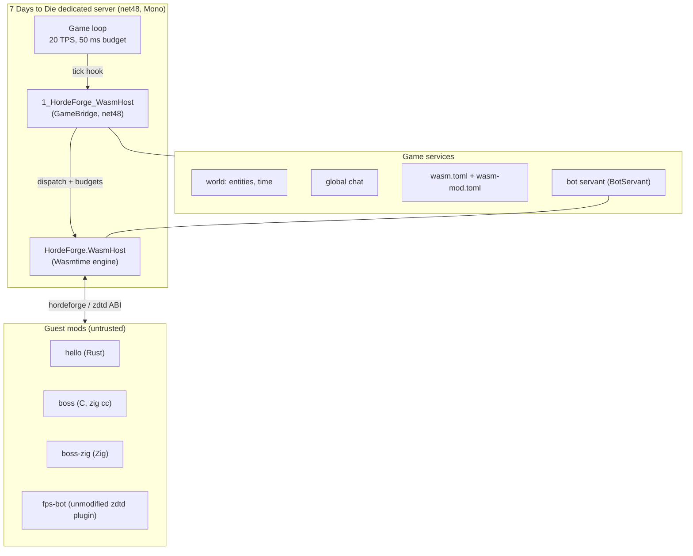
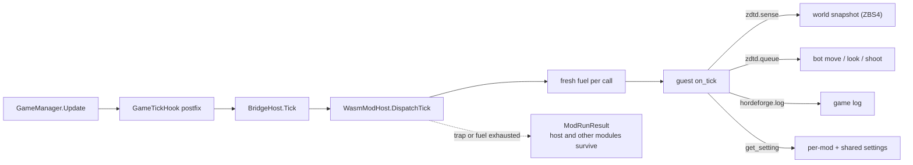
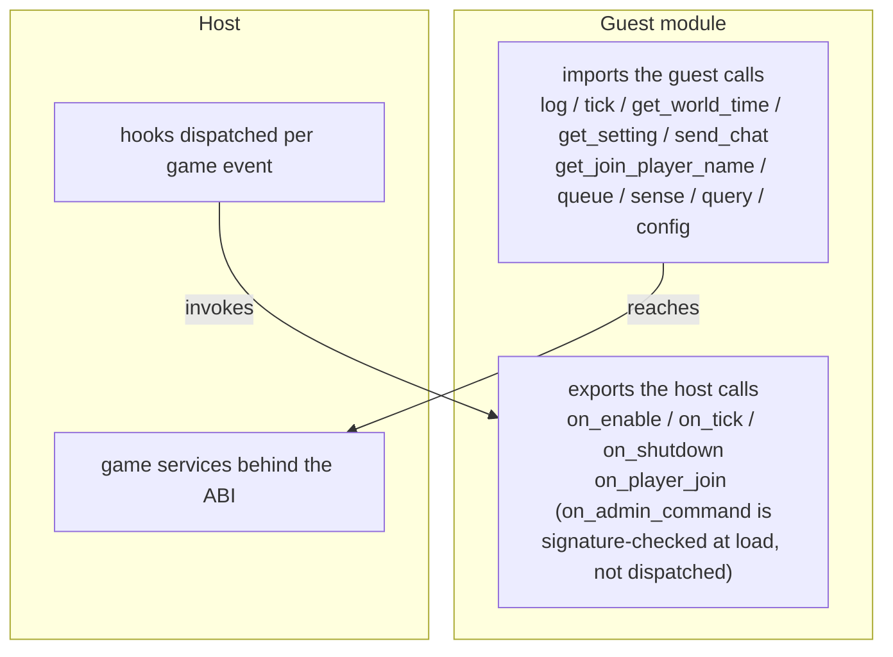
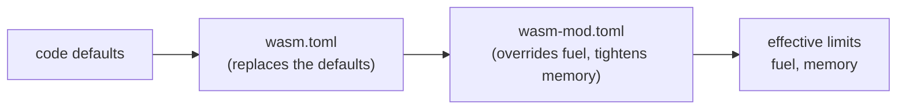

# 🧫 Quarantine (WasmHost)

> **Part of [HordeForge](https://github.com/hordeforge)**: High-Performance Systems Engineering for 7 Days to Die.


> **EXPERIMENT.** This project is an experiment: the ABI and host API are
> expected to change, the in-game bridge has run live only inside a
> containerized dedicated server (Windows native loading and long-soak
> behavior remain unproven), and nothing here is production-ready. It exists
> to answer one question: can 7 Days to Die dedicated servers host untrusted
> mods safely inside a WebAssembly sandbox?

## What this is

A mod host that runs guest mods as `wasm32-wasip1` WebAssembly modules inside
an embedded [Wasmtime](https://wasmtime.dev) engine, with hard limits.
Codename **Quarantine**: untrusted mod code is treated like the infected,
contained by the host with hard limits so it can never reach the game
process.

- **Fuel**: every guest call (on_enable, on_tick, on_player_join,
  on_shutdown) gets a fixed instruction budget; a burning loop stops at the
  budget and reports `FuelExhausted`.
- **Memory**: a guest's declared memory maximum is checked at load time
  against the host cap; oversized modules are rejected.
- **Module size**: a .wasm file larger than the cap is refused.
- **No game access beyond the ABI**: guests see no game objects, no
  Reflection, no .NET types. They talk to the game only through the
  documented host imports (see [docs/ABI.md](docs/ABI.md)).

A thin net48 mod (`1_HordeForge_WasmHost`) embeds the host in the dedicated
server, drives guests from `GameManager.Update` at the game tick rate, and
exposes a `wasm` console command (`list`, `load`, `reload`, `unload`,
`status`, `help`).

## Layout

| Path | What |
|---|---|
| `src/HordeForge.WasmHost` | Embeddable host library (netstandard2.0 + net8.0) |
| `src/GameBridge` | net48 in-game mod (ModApi, tick hook, console commands) |
| `samples/` | Rust guest SDK (`guest-common`) and example guests |
| `tests/` | Host test suite + prebuilt fixtures |
| `tools/targetcheck` | Validates game API targets against a server install |
| `tools/doccheck.py` | Docs quality gate (em dashes, links, attribution) |

## How it fits together


```mermaid
flowchart TB
    subgraph Game["7 Days to Die dedicated server (net48, Mono)"]
        LOOP["Game loop<br/>20 TPS, 50 ms budget"]
        BRIDGE["1_HordeForge_WasmHost<br/>(GameBridge, net48)"]
        HOST["HordeForge.WasmHost<br/>(Wasmtime engine)"]
        LOOP -->|"tick hook"| BRIDGE
        BRIDGE -->|"dispatch + budgets"| HOST
    end

    subgraph Services["Game services"]
        WORLD["world: entities, time"]
        CHAT["global chat"]
        SETTINGS["wasm.toml + wasm-mod.toml"]
        SERVANT["bot servant (BotServant)"]
    end

    subgraph Guests["Guest mods (untrusted)"]
        HELLO["hello (Rust)"]
        BOSS["boss (C, zig cc)"]
        BOSSZIG["boss-zig (Zig)"]
        FPS["fps-bot (unmodified zdtd plugin)"]
    end

    HOST <-->|"hordeforge / zdtd ABI"| Guests
    BRIDGE --- Services
    SERVANT --- HOST
```

One game tick in detail: every guest call runs under a fresh fuel budget,
and a trapped or fuel-burning guest is reported, never fatal.


```mermaid
flowchart LR
    U["GameManager.Update"] --> H["GameTickHook postfix"]
    H --> T["BridgeHost.Tick"]
    T --> D["WasmModHost.DispatchTick"]
    D --> F["fresh fuel per call"]
    F --> G["guest on_tick"]
    G -->|"zdtd.sense"| S["world snapshot (ZBS4)"]
    G -->|"zdtd.queue"| Q["bot move / look / shoot"]
    G -->|"hordeforge.log"| L["game log"]
    G -->|"get_setting"| K["per-mod + shared settings"]
    D -. "trap or fuel exhausted" .-> R["ModRunResult<br/>host and other modules survive"]
```

The ABI surface (details in [docs/ABI.md](docs/ABI.md)):


```mermaid
flowchart TB
    subgraph G["Guest module"]
        E["exports the host calls<br/>on_enable / on_tick / on_shutdown<br/>on_player_join (on_admin_command is<br/>signature-checked at load, not dispatched)"]
        I["imports the guest calls<br/>log / tick / get_world_time / get_setting / send_chat<br/>get_join_player_name / queue / sense / query / config"]
    end
    subgraph H["Host"]
        HE["hooks dispatched per game event"]
        HI["game services behind the ABI"]
    end
    HE -->|"invokes"| E
    I -->|"reaches"| HI
```

Config load order (docs/CONFIG.md). Shared `wasm.toml` [limits] replace the
code defaults at host start, so an operator may raise them; a per-mod
`wasm-mod.toml` overrides `fuel_per_call` (bounded by the 50,000,000
instruction parser ceiling, not by the shared value, so a mod can raise it
and the bridge logs that it did) and can only tighten `max_memory_bytes`.
The module size cap is not configurable from either file; it lives on
`WasmHostConfig`.


```mermaid
flowchart LR
    CODE["code defaults"] --> SHARED["wasm.toml<br/>(replaces the defaults)"] --> MOD["wasm-mod.toml<br/>(overrides fuel, tightens memory)"] --> EFF["effective limits<br/>fuel, memory"]
```

## Why Wasmtime

`Wasmtime` on NuGet (the official Bytecode Alliance .NET binding) is the most
popular embeddable WebAssembly runtime for .NET by two orders of magnitude
(1.6M downloads vs. 10K for the next candidate), is actively maintained, and
ships exactly the sandbox primitives a 20 TPS game server needs: WASI
preview 1, per-call fuel budgets, memory limits, and trap reporting. The
engine underneath is native Rust; the binding bundles the right native
library per platform. See [docs/ARCHITECTURE.md](docs/ARCHITECTURE.md).

## Quick start

```bash
make build          # host + tests
make test           # run the sandbox test suite
make bridge-check   # verify the game API targets on your server install
make dist           # stage the modlet under dist/ (plus a CycloneDX SBOM)
make pack           # pack the host library as a NuGet package under artifacts/
```

`make build` and `make test` are all a new contributor needs: they need only
the .NET 8 SDK (pinned by `global.json`), and the sandbox suite runs against
the guest fixtures already committed under `tests/fixtures`. The targets
that read versions out of Python (`make dist`, `make pack`, `make locks`)
are the ones that need Python 3. The remaining targets need more of a
machine, and `make help` names what each one is missing before it fails:

| Target | Needs |
|---|---|
| `make fixtures` | `make toolchain` (the in-project rustup), zig, and the `zdtd-server` checkout as a sibling |
| `make samples` / `make samples-check` | `make toolchain` |
| `make boss` / `make boss-zig` | zig |
| `make dist` | everything `make fixtures` needs, plus a .NET 8 SDK, Python 3, and a 7 Days to Die Dedicated Server install at `GAME_DIR` |
| `make bridge` / `make bridge-check` | a .NET 8 SDK and a dedicated server install at `GAME_DIR` |
| `make pack` | a .NET 8 SDK and Python 3 |
| `make test-tools` | Python 3 |
| `make tools-check` | Python 3 and the pinned ruff |

`make toolchain` populates `.cargo/` and `.rustup/` inside the checkout using
rustup from your PATH, so no Rust is installed system-wide; CI runs the same
target, and both install the channel declared in
`samples/rust-toolchain.toml`. `make test TEST_FILTER='FullyQualifiedName~WasmModHostTests'` runs one
test or class while you work, and `make test-list` prints every name such a
filter can match (a filter that matches nothing fails, because a green run that
tested nothing is the worst possible answer). The same shape exists for the
Python tooling: `make test-tools TOOLS_PATTERN='test_doccheck.py'` runs one
tools test file, and `make tools-check` runs the whole tools half of
`make check-ci` (the four Python gates, their unit tests, and ruff) in under a
second, with no .NET SDK, no Rust toolchain and no game install.

Copy `dist/Mods` into the dedicated server's `Mods/` folder, start the server
with EAC off (any C# mod forces `-noeac`), and run `wasm status` from the
server console. Copying the staged tree over an existing `Mods/` replaces the
files it carries, `Mods/Wasm/<id>/config.toml` among them, so keep operator
edits somewhere the copy does not reach before re-staging. The staged native
engine (`Native/libwasmtime.so`, `.dylib`, or `.dll`) matches the OS and
architecture of the machine that ran `make dist`, so build on the platform
family your server runs on (Linux or Windows; macOS has no dedicated server).

Code that embeds the host library in its own .NET project takes it as a NuGet
package instead: `make pack` writes
`artifacts/packages/HordeForge.WasmHost.<version>.nupkg` with a
netstandard2.0 and a net8.0 assembly, the README, and the license and
third-party notices for the shipped Wasmtime closure. The package is not on
a public feed yet, so reference it from a local one (`dotnet nuget add source
./artifacts/packages`, then `dotnet add package HordeForge.WasmHost`) or
add a `ProjectReference` to `src/HordeForge.WasmHost/HordeForge.WasmHost.csproj`.
The Wasmtime binding comes along as a declared dependency of the package
under both target frameworks, so nothing else has to be referenced.

The `hello` sample module logs on
load, reports every 100 ticks, and sends a chat greeting every 1000 ticks.

The Makefile drives a POSIX shell (GNU make plus `sh`): the in-project
`cargo` (installed by `make toolchain`, on the channel pinned in
`samples/rust-toolchain.toml`) for the Rust guests, `zig 0.16.0` for the C
and Zig guests (a different release is rejected by name before the compile),
and Python 3 for the tools gate, resolved as `python3` or as
`python` where that is the interpreter name. `GAME_DIR` defaults to `7 Days to Die
Dedicated Server` under the Steam library root of the platform
(`C:\Program Files (x86)\Steam\steamapps\common` on Windows,
`$HOME/.local/share/Steam/steamapps/common` on Linux,
`$HOME/Library/Application Support/Steam/steamapps/common` on macOS); pass
`GAME_DIR=/path/to/install` when Steam lives elsewhere. `make dist` reads the
native engine out of the NuGet global packages folder, so it honors
`NUGET_PACKAGES` when that is set and falls back to `$HOME/.nuget/packages`.
CI runs the host library build and its test suite on Linux and on Windows,
which is the platform the net48 bridge is loaded on; the Makefile targets
above `make build` need GNU make and a game install, so a Windows run of
those is unproven.

### Embedding the host library

`HordeForge.WasmHost` is a plain .NET library (netstandard2.0 + net8.0);
reference it and drive the host yourself:

```csharp
using HordeForge.WasmHost.Abi;
using HordeForge.WasmHost.Config;
using HordeForge.WasmHost.Core;

var api = new MyGameApi();                    // implements IGameHostApi
using var host = new WasmModHost(api, new WasmHostConfig());

host.LoadModule("hello", File.ReadAllBytes("hello.wasm"));
foreach (ModRunResult result in host.DispatchInit())
{
    Console.WriteLine($"{result.ModId}: init {result.Status}");
}

long gameTick = 0;
while (running)                               // once per game tick; the host
{                                             // serializes its entry points,
    foreach (ModRunResult result in host.DispatchTick(gameTick++))
{                                         // so a second thread only blocks
        if (!result.Ok)                       // until this dispatch returns
        {
            Console.WriteLine($"{result.ModId}: {result.Message} {result.Details}");
        }
    }
}

ModRunResult? shutdown = host.Unload("hello");
```

A guest fault never throws: every call outcome is a `ModRunResult`
(`Ok`, `Trap`, `FuelExhausted`, `Error`). Only load rejection throws,
as `WasmModLoadException` with the offending mod id (a null module or an
invalid id throws `ArgumentNullException` / `ArgumentException`, and a call
after `Dispose` throws `ObjectDisposedException`). Each `Dispatch*` call
builds its own result list and hands it back read-only, so a later dispatch
(including one on another thread) never rewrites a list you are still
reading. Limits live on `WasmHostConfig` (fuel per call, memory ceiling,
module size cap) and are validated when the host is constructed. The shared
operator file layers over those defaults before the host is built, which is
the middle step of the load order in [docs/CONFIG.md](docs/CONFIG.md):

```csharp
var config = new WasmHostConfig();
if (SharedLimits.TryApply(config, "/opt/server/Mods/Wasm/wasm.toml", out string reason) == null
    && reason.Length != 0)
{
    throw new InvalidOperationException("wasm.toml is unusable: " + reason);
}

using var host = new WasmModHost(api, config);
```

A shared file that is absent is not a failure (`TryApply` returns a null
manifest and an empty reason); one that exists but cannot be parsed is, since
the engine would then run under limits the operator never wrote. Per-mod
`wasm-mod.toml` limits are applied by `LoadModule` itself. See
[docs/ARCHITECTURE.md](docs/ARCHITECTURE.md) and [docs/ABI.md](docs/ABI.md).

Failure outcomes are typed, so nothing needs message matching:

```csharp
using HordeForge.WasmHost;                  // exception types
using HordeForge.WasmHost.Abi;              // AbiConstants
using HordeForge.WasmHost.Registry;         // ModManifest

try
{
    ModManifest manifest = ModManifest.ParseToml(File.ReadAllText(manifestToml), id);
    host.LoadModule(id, File.ReadAllBytes(moduleWasm), manifest);   // the host owns it; Unload releases it
}
catch (WasmManifestException ex)            // broken wasm-mod.toml; ModId is the mod
{
    Console.WriteLine($"{ex.ModId}: manifest is invalid ({ex.Message})");
}
catch (ManifestReadException ex)            // missing, oversize, or non-UTF-8 file
{
    Console.WriteLine($"{ex.Path}: {ex.Reason}");
}
catch (WasmModLoadException ex)             // the module itself was refused
{
    Console.WriteLine($"{ex.ModId}: {ex.Message}");
}

foreach (ModRunResult result in host.DispatchTick(gameTick))
{
    if (result.Status == ModRunStatus.Error && result.GuestStatus == AbiConstants.StatusNotImplemented)
    {
        // The guest declines this event on purpose; not a failure to alert on.
    }
}
```

`ManifestReadException` and `WasmManifestException` both derive from types
the surrounding code already catches (`InvalidOperationException` and
`WasmModLoadException` respectively), so the finer-grained catches are
optional.

## Safety model

The threat model is "the guest is malicious." Guests cannot read or write
outside their own linear memory and reach the game process only through the
documented imports, and are always interrupted at their budget. The imports
do carry game authority: a guest can broadcast chat, and through the bot
servant it can spawn entities and apply damage. Operator-facing guarantees
and limits are in [SECURITY.md](SECURITY.md); the full model, including the
gaps, is in [docs/THREAT_MODEL.md](docs/THREAT_MODEL.md).

Upgrading an operator tree, an embedded host, or a guest across a release
with breaking changes: [docs/MIGRATION.md](docs/MIGRATION.md) names the steps
per release.

## Status

- [x] Host library: load, dispatch, fuel, memory cap, traps (tested)
- [x] Rust guest SDK (`guest-common`) plus C and Zig sample guests
- [x] net48 bridge compiles against V3.1.0 and all targets are verified
- [x] In-game acceptance on a live dedicated server (docker container, fresh steamcmd install, V 3.1.0 b14)
- [x] Unmodified zdtd fps_bot runs: sense, queue, and the bot servant drive live bots in combat
- [ ] ABI stability review before anything is called stable

## License

MIT, see [LICENSE](LICENSE). The modlet redistributes Wasmtime and the
.NET Foundation closure; their licenses and attribution are in
[THIRD-PARTY-NOTICES.md](THIRD-PARTY-NOTICES.md), which `make dist` stages
next to the binaries it covers.
